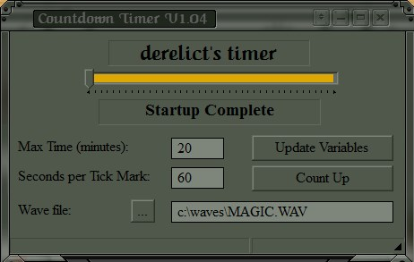

### CDTIMER - derelict's Countdown Timer utility.

This application is copyright (c) 2003-2017  Derell Licht  
This program, and its source code, are distributed as unrestricted freeware.
You can use them for any purpose, personal or commercial, in whole or in part,
for any purpose that you wish, without contacting me further.

Obtain [source code](https://github.com/DerellLicht/cdtimer) here

Download [Windows installer](https://github.com/DerellLicht/bin/raw/master/cdtimer.zip) here

This is a simple, slider-based countdown timer.  
It will display a "Time's Up" message box when the timer expires.  
The current time remaining is shown on the title bar, 
so it will remain visible if the window is minimized.

CdTimer stores its MaxTimeScale and SecondsPerTickMark settings in
a file called cdtimer.ini, which is located in the place where cdtimer.exe
was located.  This file will be created the first time CdTimer is run.

The Status field is only used for debug/error messages; 
normally, it should just say "none".

